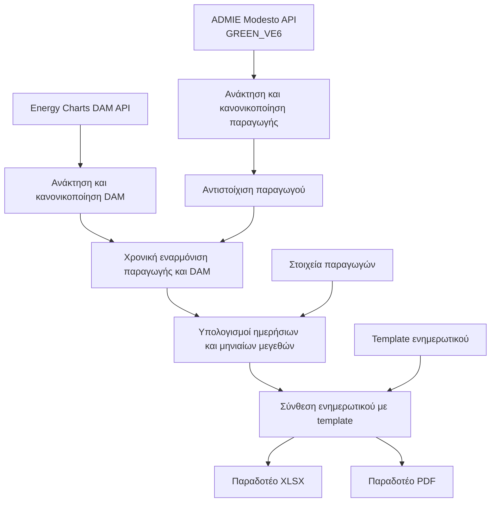

# Διαδικασία Παραγωγής Μηνιαίων Ενημερωτικών Σημειωμάτων

## Σκοπός
Η διαδικασία παραγωγής μηνιαίων ενημερωτικών σημειωμάτων οργανώνει ενιαία τη ροή από τη λήψη των πρωτογενών δεδομένων έως την εξαγωγή των τελικών παραδοτέων. Η λογική της βασίζεται στην ελεγχόμενη ενοποίηση δεδομένων παραγωγής και δεδομένων αγοράς, ώστε το τελικό αποτέλεσμα να είναι συνεπές, επαναλήψιμο και κατάλληλο για επιχειρησιακή χρήση.

---

## Εξωτερικές και Εσωτερικές Πηγές Δεδομένων
Τα δεδομένα παραγωγής προέρχονται από το ADMIE Modesto API μέσω του endpoint 
`https://market-extranet-api.admie.gr/modestoWS/Service_EME_Port?wsdl`, το οποίο παρέχει τα μηνύματα GREEN_VE6 στο απαιτούμενο χρονικό εύρος. 

Οι τιμές αγοράς προέρχονται από το Energy Charts DAM API μέσω του endpoint `https://api.energy-charts.info/price`, από το οποίο αντλούνται οι τιμές με χρονοσήμανση για την περίοδο αναφοράς. 

Παράλληλα, η διαδικασία χρησιμοποιεί εσωτερικά δεδομένα αναφοράς για τους παραγωγούς, καθώς και το πρότυπο του ενημερωτικού σημειώματος, ώστε τα αποτελέσματα να αποτυπώνονται σε σταθερή μορφή.

---

## Διάγραμμα Ροής Δεδομένων και Διαδικασίας

---

## Βήμα 1: Ανάκτηση δεδομένων παραγωγής από Modesto
### Από πού παίρνουμε τα δεδομένα
Η είσοδος του πρώτου σταδίου είναι τα δεδομένα παραγωγής που ανακτώνται από το ADMIE Modesto API, συγκεκριμένα από το παρακάτω endpoint με βάση το ημερολογιακό διάστημα εκκαθάρισης του μήνα.

`https://market-extranet-api.admie.gr/modestoWS/Service_EME_Port?wsdl`, 

### High-level περιγραφή διαδικασίας
Η διαδικασία εκκινεί με αίτημα για τη λίστα διαθέσιμων μηνυμάτων και στη συνέχεια εντοπίζει τα μηνύματα που αφορούν την παραγωγή τύπου GREEN_VE6. Αφού ολοκληρωθεί η λήψη του σχετικού περιεχομένου, το σύνολο δεδομένων μετατρέπεται σε δομημένη μορφή κατάλληλη για ενοποίηση και επεξεργασία στα επόμενα στάδια.

---

## Βήμα 2: Κανονικοποίηση και αντιστοίχιση παραγωγής σε παραγωγό

Το στάδιο χρησιμοποιεί αφενός τα δεδομένα παραγωγής που έχουν ήδη ανακτηθεί από το Modesto και αφετέρου τα εσωτερικά στοιχεία αναφοράς παραγωγών, στα οποία περιλαμβάνεται η αντιστοίχιση κωδικού μονάδας με επιχειρησιακή ταυτότητα παραγωγού.

Αρχικά γίνεται κανονικοποίηση της πληροφορίας παραγωγής ώστε τα χρονικά και ταυτοποιητικά πεδία να έχουν ενιαία μορφή. Στη συνέχεια πραγματοποιείται αντιστοίχιση κάθε εγγραφής παραγωγής με τον σωστό παραγωγό, ώστε το dataset να αποκτήσει πλήρες επιχειρησιακό περιεχόμενο και να μπορεί να χρησιμοποιηθεί για αξιόπιστη οικονομική εκκαθάριση.

---

## Βήμα 3: Ανάκτηση και κανονικοποίηση τιμών DAM

Οι τιμές αγοράς λαμβάνονται από το Energy Charts DAM API μέσω του endpoint 
`https://api.energy-charts.info/price`

Η διαδικασία ανακτά τη χρονοσειρά τιμών και τη μετασχηματίζει σε μορφή συμβατή με τα δεδομένα παραγωγής ως προς τη χρονολογική αναφορά. Μετά τον χρονικό και ποιοτικό έλεγχο, διατηρείται μόνο το σύνολο τιμών που αφορά το ζητούμενο διάστημα εκκαθάρισης, ώστε να αποφευχθούν αποκλίσεις στο στάδιο σύζευξης.

---

## Βήμα 4: Χρονική εναρμόνιση παραγωγής και DAM

Η είσοδος του σταδίου είναι δύο κανονικοποιημένες χρονοσειρές, η μία από τα δεδομένα παραγωγής και η άλλη από τις τιμές DAM, οι οποίες έχουν διαφορετική λογική χρονικής αναφοράς και χρειάζονται ευθυγράμμιση πριν την οικονομική επεξεργασία.

Σε αυτό το στάδιο εφαρμόζεται κοινό πλαίσιο χρονικής ερμηνείας ώστε κάθε τιμή παραγωγής να συσχετίζεται με τη σωστή τιμή αγοράς. Η εναρμόνιση ακολουθεί σαφείς κανόνες αλληλουχίας και αντιμετωπίζει ειδικές περιπτώσεις ημερολογιακής μετάβασης ή αλλαγής ώρας, με στόχο να διατηρείται λειτουργική και αριθμητική συνέπεια.

---

## Βήμα 5: Υπολογισμός ενεργειακών και οικονομικών μεγεθών

Οι υπολογισμοί βασίζονται στη συζευγμένη πληροφορία ενέργειας και τιμής αγοράς, καθώς και στις παραμέτρους χρέωσης που αντιστοιχούν στον παραγωγό από το εσωτερικό σύστημα αναφοράς.

Η διαδικασία μετατρέπει τη συζευγμένη πληροφορία σε αξία ανά χρονικό βήμα και στη συνέχεια συγκεντρώνει τα αποτελέσματα σε ημερήσιο και μηνιαίο επίπεδο. Στο τελικό αποτέλεσμα περιλαμβάνονται τα βασικά μεγέθη που απαιτούνται για το ενημερωτικό, όπως συνολική ενέργεια, συνολική αξία, προμήθεια και μεσοσταθμική τιμή, με ενιαία λογική υπολογισμού.

---

## Βήμα 6: Σύνθεση ενημερωτικού σημειώματος

Το στάδιο αυτό λαμβάνει τα υπολογισμένα μεγέθη του προηγούμενου βήματος, τα στοιχεία ταυτότητας και φορολογικής πληροφορίας του παραγωγού από το μητρώο και το πρότυπο μορφοποίησης του ενημερωτικού.

Η σύνθεση γίνεται με χαρτογράφηση των επιχειρησιακών και οικονομικών δεδομένων στα αντίστοιχα πεδία του προτύπου, έτσι ώστε να παραχθεί ενιαίο, καθαρό και αναγνώσιμο έγγραφο. Η διαδικασία διασφαλίζει ότι η παρουσίαση είναι ομοιογενής για όλους τους παραγωγούς και ότι το τελικό περιεχόμενο παραμένει πλήρες και ελέγξιμο.

---

## Βήμα 7: Παραγωγή τελικών παραδοτέων

Η έξοδος προκύπτει από το πλήρως συντεθειμένο ενημερωτικό record, το οποίο αποτελεί τη μοναδική πηγή για τη δημιουργία των τελικών μορφών διάθεσης.

Η διαδικασία παράγει το τελικό παραδοτέο σε μορφή υπολογιστικού φύλλου και στη συνέχεια εξάγει αντίστοιχη έκδοση PDF, διατηρώντας κοινή λογική περιεχομένου. Με την ολοκλήρωση του σταδίου, τα παραδοτέα είναι έτοιμα για εσωτερική κυκλοφορία ή αποστολή, με τυποποιημένη οργάνωση που διευκολύνει την επιχειρησιακή χρήση.

